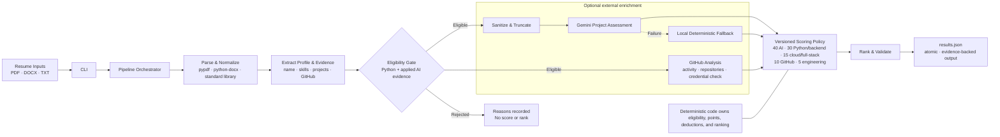

# SDE Intern Resume Screener

## What this project does

This project screens a directory of resumes for an SDE internship that requires Python and AI/ML
experience. It was built for the supplied 50-resume assessment dataset.

The CLI:

- parses PDF, DOCX, and TXT resumes;
- extracts candidate details, skills, project evidence, and GitHub profiles;
- rejects candidates without both Python and AI/ML evidence;
- scores eligible candidates out of 100;
- uses Gemini for structured project-depth assessment, with a deterministic fallback;
- analyzes public GitHub activity and repositories; and
- writes every candidate outcome to `output/results.json`.

The committed result contains 50 parsed resumes: 36 eligible, 14 rejected, and 0 failed.

## Approach

The application runs the following pipeline:

1. **Discover and parse:** find supported files, detect exact duplicates by SHA-256, extract text,
   and isolate malformed-file failures.
2. **Extract evidence:** identify name, email, GitHub URL, skills, Python evidence, AI/ML evidence,
   and engineering evidence.
3. **Apply the eligibility gate:** require Python evidence plus applied AI/ML project or
   implementation evidence before scoring.
4. **Assess project depth:** ask Gemini for bounded depth labels. If Gemini is unavailable,
   rate-limited, or returns invalid data, use the deterministic assessor.
5. **Analyze GitHub:** score recent public activity and relevant non-fork repositories. Optionally
   check a bounded set of public files for high-confidence exposed-credential patterns.
6. **Calculate scores:** convert evidence and depth labels into fixed subcategory points. Gemini
   never assigns numeric scores or rank.
7. **Rank and write:** rank eligible candidates using deterministic tie-breakers, validate the
   complete result with Pydantic, and atomically write JSON.

One bad resume or failed external request does not stop the batch.

## Design Decisions

- The input can contain PDF, DOCX, and TXT resumes. The project uses `pypdf`, `python-docx`, and
  Python's standard library respectively, then sends all extracted text through the same pipeline.
- PDF layout text and document metadata are also checked because names are sometimes stored in
  metadata or placed beside contact details in complex headers.
- Every candidate is checked against a fixed job-related skill taxonomy covering Python, AI,
  backend, databases, cloud, deployment, frontend, and engineering practices.
- The CLI supports two modes: Gemini-assisted assessment and fully local deterministic assessment.
  The commands for both modes are listed in the Run section.
- Before a Gemini request, direct contact information and URLs are replaced with placeholders and
  the remaining text is truncated. Technical project, education, and employment details remain.
- Gemini has a 45-second timeout per attempt and one retry. If it still fails, the candidate is
  assessed locally instead of failing the batch.
- GitHub scoring considers recent public activity and relevant public repositories. A bounded
  security check can deduct only GitHub points for high-confidence exposed credentials.
- GitHub failures award zero GitHub points but never change resume eligibility. Repeated references
  to the same normalized GitHub username reuse one assessment.
- Eligibility, numeric scoring, deductions, and ranking remain deterministic. Gemini returns only
  schema-validated project-depth labels and evidence; it never assigns points or rank.
- Scoring rules live in one versioned policy, and each eligible result records the evidence used
  for every score category.

## Eligibility

A candidate must have both:

1. Python evidence; and
2. applied AI/ML project or implementation evidence, such as machine learning, deep learning,
   NLP, LLMs, RAG, or agents.

An AI term in a skills list is not enough. Coursework-only, tutorial-only, negated, or incidental
mentions also do not satisfy the gate. Rejected candidates remain in the output with explicit
reasons, but receive no score or rank. GitHub does not affect eligibility.

## Scoring

Only eligible candidates are scored. The five positive categories total 100 points.

| Category | Maximum |
|---|---:|
| AI and project depth | 40 |
| Python and backend | 30 |
| Cloud and full-stack | 15 |
| GitHub | 10 |
| Engineering depth | 5 |

### Evidence strength

Resume evidence uses these multipliers:

| Evidence | Multiplier |
|---|---:|
| Incidental | 0.00 |
| Skill mention | 0.45 |
| Applied implementation | 0.75 |
| Advanced implementation | 1.00 |

For a resume-based subcategory, the strongest matching evidence determines the multiplier:

```text
subcategory score = round(subcategory maximum × evidence multiplier)
```

### AI and project depth: 40 points

Gemini or the deterministic fallback returns depth labels. Neither returns points.

| Subcategory | Maximum |
|---|---:|
| Overall project implementation | 8 |
| Retrieval/RAG | 8 |
| Agent systems | 8 |
| Data workflows | 6 |
| Evaluation | 5 |
| Ownership | 5 |

Depth multipliers are `none = 0`, `basic = 0.25`, `applied = 0.65`, and `advanced = 1.00`.
The six weighted values are summed and rounded once, with a maximum of 40.

### Python and backend: 30 points

| Subcategory | Maximum | Evidence examples |
|---|---:|---|
| Python implementation | 10 | Python, Django, Flask, FastAPI |
| Backend/API work | 8 | APIs, backend services, Django, Flask, FastAPI |
| Databases | 5 | SQL, PostgreSQL, MySQL, MongoDB, Redis |
| Async and queues | 4 | asyncio, Celery, Kafka, RabbitMQ |
| Ownership | 3 | Project ownership depth |

The first four use evidence-strength multipliers. Ownership uses project-depth multipliers. The
category is capped at 30.

### Cloud and full-stack: 15 points

| Subcategory | Maximum |
|---|---:|
| Cloud platforms: AWS, GCP, Azure | 5 |
| Containers: Docker, Kubernetes | 4 |
| CI/CD and deployment | 3 |
| Frontend: React, Next.js, TypeScript | 3 |

Each subcategory uses the strongest matching evidence multiplier. The category is capped at 15.

### GitHub: 10 points

GitHub contributes up to 5 activity points and 5 repository points.

Activity scoring:

```text
signal = public events in the last 90 days + min(repositories pushed in the last 180 days, 5)

signal 12+ → 5 points
signal  7+ → 4 points
signal  4+ → 3 points
signal  2+ → 2 points
signal  1+ → 1 point
otherwise → 0 points
```

Repository scoring uses non-fork, non-archived public repositories. Relevance comes from Python,
backend, API, ML, LLM, RAG, agent, NLP, PyTorch, TensorFlow, Django, Flask, or FastAPI terms in the
repository name, description, language, or topics.

```text
repository match = 4 × matched terms + min(stars, 5) + min(forks, 3)
relevant repository = repository match > 0
strong top match = highest repository match >= 8

4+ relevant repositories and a strong top match → 5 points
3+ relevant repositories                        → 4 points
2+ relevant repositories                        → 3 points
1 relevant repository                           → 2 points
other owned public repositories                  → 1 point
no owned public repositories                     → 0 points
```

The bounded security check can deduct GitHub points:

| Finding | Deduction |
|---|---:|
| Private key or GitHub token pattern | 5 |
| Google or OpenAI-style API key pattern | 4 |
| Hard-coded credential pattern | 3 |

Multiple findings use the largest deduction, not their sum. The deduction is capped at 5, cannot
make the GitHub score negative, and is zero when the scan is incomplete.

```text
github = max(0, min(10, activity + repositories) - security deduction)
```

The scanner stores only the repository, file path, credential type, and an HMAC fingerprint. It
does not store the detected value.

### Engineering depth: 5 points

One point is awarded for each area found in the resume:

- testing;
- monitoring, logging, or observability;
- security, authentication, or authorization;
- performance, latency, or scaling; and
- documentation or README work.

### Project-quality deductions

These deductions apply to the total score, not the GitHub category.

| Finding | Deduction |
|---|---:|
| Thin wrapper: low / medium / high | 5 / 10 / 15 |
| Tutorial-only work: low / high | 5 / 10 |

The combined project-quality deduction is capped at 20.

```text
total = clamp(
    AI + Python/backend + Cloud/full-stack + GitHub + Engineering
    - project-quality deduction,
    0,
    100,
)
```

Candidates are ranked by total score, then AI score, then Python/backend score, then name.

## Architecture

The project is a CLI-first modular monolith. Local code owns parsing, eligibility, scoring,
ranking, validation, and output. Gemini and GitHub are optional enrichment adapters; either can
fail without stopping the batch.



LLM and GitHub enrichment use independent bounded worker pools. Multiple resumes that reference
the same normalized GitHub username share one assessment. Typed Pydantic models define the data
contracts between stages and validate the complete output before it replaces the previous file.

## Setup

Requires Python 3.11 or newer.

```bash
python -m venv .venv
source .venv/bin/activate
python -m pip install -e ".[dev]"
cp .env.example .env
```

Set the credentials in `.env`:

```dotenv
GEMINI_API_KEY=your_gemini_key
GITHUB_TOKEN=your_fine_grained_github_token
```

`.env` is ignored by Git. The GitHub token only needs read access to public resources.

## Run

```bash
python main.py --input ./resumes --output ./output/results.json
```

Run without external services:

```bash
python main.py --input ./resumes --output ./output/results.json --no-llm --no-github
```

Options:

```text
--recursive          Include nested directories
--no-llm             Use deterministic project assessment
--no-github          Disable GitHub enrichment
--no-security-scan   Disable public-repository credential checks
--compact            Write compact JSON
--env-file PATH      Use a different environment file
```

## Output and privacy

`output/results.json` contains run metadata, batch totals, every candidate outcome, eligibility
evidence, name-source confidence, category scores and their evidence, scoring-policy version,
deductions, GitHub status, warnings, and ranks. It also contains candidate email addresses and
should be handled as private applicant data.

Before a Gemini request, the application removes detected names, emails, phone numbers, and URLs.
Responses must match a schema, and cited evidence is kept only when it occurs in the resume. Use
`--no-llm` if resume text must not be sent to an external provider. Review Google's current
[Gemini API pricing and data-use terms](https://ai.google.dev/gemini-api/docs/pricing) before using
real applicant data.

## Tests

```bash
PYTHONPATH=src python -m unittest discover -s tests -v
```

## If I Had More Time

- Accept a job description as input and generate a configurable skill taxonomy and scoring policy
  instead of relying on the current fixed SDE-intern rules.
- Build a human-labeled evaluation set to measure eligibility precision, recall, name-extraction
  accuracy, score consistency, and ranking agreement.
- Add OCR for scanned PDFs and improve recovery for complex multi-column or graphical resumes.
- Add persistent, expiry-aware Gemini and GitHub caches, request-budget tracking, and resumable
  batch runs for larger datasets.
- Compare resume claims with repository languages, files, and project structure while keeping
  GitHub optional and avoiding unfair penalties for candidates with limited public work.
- Add bias and privacy audits, optional email redaction in exported results, and configurable data
  retention before using the tool with real applicants.
- Add a FastAPI layer for uploading resume batches, starting screening jobs, checking progress,
  and retrieving results without changing the core pipeline.
- Add a small reviewer UI for filtering, comparing evidence, and recording human decisions after
  the core ranking behavior has been evaluated.

## Documentation

- [Product requirements](docs/PRD.md)
- [Technical requirements](docs/TRD.md)
- [Implementation plan](docs/IMPLEMENTATION_PLAN.md)

## Repository layout

```text
docs/                   requirements and implementation plan
output/results.json     generated assessment result
src/resume_screener/    application modules
tests/                  unit and end-to-end tests
main.py                 CLI entry point
```
