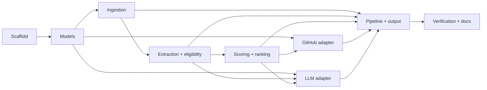

# Implementation Plan: AI Resume Screening and Ranking System

| Field | Value |
|---|---|
| Plan version | 1.0 |
| Related documents | `AI_Resume_Screening_PRD.md`, `AI_Resume_Screening_TRD.md` |
| Delivery target | Functional MVP within 2–3 hours |
| Delivery model | Sequential critical path with optional bonuses after core verification |
| Primary language | Python 3.11+ |

## 1. Delivery objective

Deliver a runnable CLI that processes a directory of resumes, applies explainable Python-and-AI eligibility rules, scores and ranks eligible candidates, performs graceful GitHub and optional LLM enrichment, and writes a schema-valid `results.json` containing every file outcome and a reconciled batch summary.

The plan explicitly protects the critical path. Optional format support, deeper GitHub scanning, richer reports, and API endpoints may not displace core parsing, hard filtering, scoring, failure isolation, tests, or documentation.

## 2. Guiding delivery rules

1. Build vertical slices that can be executed early.
2. Keep domain logic pure and test it before integrations.
3. Use fake adapters before connecting live GitHub or LLM services.
4. Treat external integrations as optional enrichments.
5. Stop optional work when a core verification gate is not passing.
6. Commit in small coherent units when using Git.
7. Do not add a frontend, database, queue, vector store, or deployment configuration during the MVP.

## 3. Scope priorities

### P0: required for a valid submission

- Project scaffold and configuration.
- PDF discovery and parsing.
- Per-file failure isolation.
- Candidate information and evidence extraction.
- Python + AI hard eligibility.
- Explainable five-category scoring and project-quality penalties.
- Deterministic ranking.
- Versioned JSON with complete batch summary.
- GitHub profile/repository/activity enrichment with graceful failure.
- Gemini adapter using `gemini-3.5-flash-lite`, with structured output and deterministic fallback.
- Focused unit/integration tests.
- README, `.env.example`, and generated sample/result output.

### P1: high-value production-minded additions

- High-confidence GitHub repository security-hygiene scanner.
- DOCX/TXT parsing.
- Async bounded enrichment.
- Prompt-injection regression test.
- Atomic output writing.

### P2: only after the submission is complete

- FastAPI wrapper.
- Persistent cache.
- OCR.
- HTML/terminal report.
- Expanded secret-detection registry.
- CI workflow and additional static analysis.

## 4. Work breakdown structure

### Phase 0 — Repository scaffold and execution skeleton

**Target:** 10 minutes
**Dependencies:** None
**Exit gate:** `python main.py --help` succeeds and tests can be discovered.

#### Tasks

- IP-0001: Create `src/` package structure and test directories.
- IP-0002: Add `pyproject.toml` with runtime and development dependencies.
- IP-0003: Add `.gitignore` for `.env`, caches, environments, and generated outputs where appropriate.
- IP-0004: Add `main.py` with argument parsing for input and output.
- IP-0005: Add a minimal settings model and startup validation.
- IP-0006: Add initial README command and Python-version requirement.

#### Verification

```bash
python main.py --help
pytest --collect-only
```

#### Deliverables

- Runnable CLI shell.
- Installable package.
- Test harness.

### Phase 1 — Domain models, errors, and output schema

**Target:** 15 minutes
**Dependencies:** Phase 0
**Exit gate:** A synthetic `BatchResult` validates and serializes.

#### Tasks

- IP-0101: Implement enums for candidate and integration statuses.
- IP-0102: Implement `Evidence`, `ResumeFile`, `ParsedResume`, and `CandidateProfile`.
- IP-0103: Implement eligibility, assessment, GitHub, score, candidate-result, and batch-result models.
- IP-0104: Add validators for score caps and batch-count reconciliation.
- IP-0105: Define typed error classes and safe failure model.
- IP-0106: Add `schema_version=1.0`.

#### Verification

- Unit test valid and invalid score breakdowns.
- Unit test candidate status invariants.
- Generate JSON Schema from the top-level result model.

#### Key implementation constraint

No integration SDK types may appear in domain models.

### Phase 2 — File discovery, parsing, and normalization

**Target:** 25 minutes
**Dependencies:** Phase 1
**Exit gate:** A directory containing valid, duplicate, empty, and corrupt fixtures completes without a batch crash.

#### Tasks

- IP-0201: Implement sorted file discovery and supported-extension filtering.
- IP-0202: Resolve paths beneath the input root and do not follow symlinks.
- IP-0203: Implement streaming SHA-256 and duplicate resolution.
- IP-0204: Define parser protocol and registry.
- IP-0205: Implement PDF parser with page preservation and safe errors.
- IP-0206: Implement conservative text normalization.
- IP-0207: Add TXT parser if the gate remains on schedule.
- IP-0208: Add DOCX parser only after PDF cases pass.

#### Verification cases

- Valid one-page PDF.
- Multi-page PDF.
- Empty PDF.
- Corrupt or non-PDF content with `.pdf` extension.
- Exact duplicate files under different filenames.
- Unsupported extension.
- Oversized file.

#### Time-box decision

If DOCX support threatens the gate, defer it. PDF correctness is mandatory.

### Phase 3 — Extraction and hard eligibility

**Target:** 25 minutes
**Dependencies:** Phase 2
**Exit gate:** The eligibility matrix passes for synthetic resumes.

#### Tasks

- IP-0301: Implement email extraction.
- IP-0302: Implement GitHub URL and username normalization.
- IP-0303: Implement basic section segmentation.
- IP-0304: Add normalized skill alias registry.
- IP-0305: Implement Python evidence detection and strength classification.
- IP-0306: Implement AI/LLM/RAG/agentic evidence detection and strength classification.
- IP-0307: Implement negation and incidental-context exclusions.
- IP-0308: Implement pure `EligibilityEngine` with canonical rejection reasons.
- IP-0309: Preserve short source evidence for each match.

#### Required eligibility matrix

| Candidate evidence | Expected result |
|---|---|
| Python project + RAG project | Eligible |
| Python only | Rejected: no AI evidence |
| AI project in JavaScript only | Rejected: no Python evidence |
| Python + LangGraph skill mention | Eligible minimum bar; low depth score without project details |
| React + Java + Python + AI | Eligible |
| “No Python experience” + AI | Rejected |
| Python course title only + AI | Rejected unless other applied/skill evidence exists |

#### Implementation note

Eligibility must work without the LLM. Model output cannot change the hard rule directly.

### Phase 4 — Scoring, penalties, and ranking

**Target:** 20 minutes
**Dependencies:** Phase 3
**Exit gate:** Score arithmetic and ranking tests pass.

#### Tasks

- IP-0401: Encode category and subcriterion caps from the PRD.
- IP-0402: Implement deterministic depth-to-points mapping.
- IP-0403: Implement Python/backend evidence rules.
- IP-0404: Implement cloud/deployment/full-stack evidence rules.
- IP-0405: Implement engineering-depth rules.
- IP-0406: Implement thin-wrapper and tutorial penalties with evidence.
- IP-0407: Enforce category caps, penalty cap, and 0–100 total.
- IP-0408: Implement deterministic ranking and tie-breaking.
- IP-0409: Ensure rejected candidates have no score or rank.

#### Verification cases

- Maximum category scores cannot exceed 40/30/15/10/5.
- Penalty arithmetic is visible and reproducible.
- Duplicate evidence does not score twice.
- An AI framework keyword alone cannot receive full project depth.
- Equal totals resolve through AI score, Python score, then name.

### Phase 5 — GitHub enrichment and security hygiene

**Target:** 30 minutes
**Dependencies:** Phases 1 and 4
**Exit gate:** Fake GitHub responses produce deterministic scores, and live failures do not affect eligibility or batch completion.

#### Tasks

- IP-0501: Define `GitHubEnricher` protocol and disabled/fake implementations.
- IP-0502: Implement shared async HTTP client with timeout and safe headers.
- IP-0503: Fetch profile, public repositories, and recent public events.
- IP-0504: Normalize 404, 403/429, 5xx, timeout, and transport outcomes.
- IP-0505: Read and respect rate-limit response headers.
- IP-0506: Implement deterministic repository selection.
- IP-0507: Implement 0–5 activity score.
- IP-0508: Implement 0–5 repository relevance score.
- IP-0509: Add per-run username and repository caches.
- IP-0510: Implement a small security-rule registry.
- IP-0511: Fetch bounded default-branch trees and selected text files.
- IP-0512: Redact matches and generate ephemeral fingerprints.
- IP-0513: Implement high-confidence-only 0–5 GitHub deduction.
- IP-0514: Ensure partial or truncated scans create no deduction.

#### Minimum security-rule set

- PEM private-key material.
- A small set of high-confidence provider-token formats.
- Non-placeholder secrets in tracked `.env`-style files.
- Hard-coded secret assignments with literal values and strong context.

#### Required exclusions

- `.env.example`, `.env.sample`, and templates.
- Placeholder and redacted values.
- Environment-variable lookups.
- Forks and archived repositories.
- Docs, fixtures, dependencies, generated output, and binaries by default.

#### Time-box fallback

If deep content scanning cannot be completed safely within the gate:

1. Ship profile, repository, event, and relevance scoring.
2. Keep the scanner interface and models.
3. Return `security_hygiene.status=not_checked` with zero deduction.
4. Document scanner completion as the first post-MVP task.

Do not ship a broad, untested regex scanner merely to claim the feature.

### Phase 6 — Gemini structured-output adapter and fallback

**Target:** 20 minutes
**Dependencies:** Phases 1, 3, and 4
**Exit gate:** Fake structured output is validated, and provider failure produces a deterministic assessment.

#### Tasks

- IP-0601: Define `ProjectAssessor` protocol.
- IP-0602: Implement `DisabledProjectAssessor` using extracted evidence.
- IP-0603: Add versioned `project_assessment_v1` prompt.
- IP-0604: Implement `GeminiProjectAssessor` using `gemini-3.5-flash-lite` and schema-constrained structured output.
- IP-0605: Validate response with Pydantic.
- IP-0606: Confirm returned evidence exists in resume text.
- IP-0607: Add one repair retry for schema-invalid output and one bounded retry path for retryable `429`/5xx responses.
- IP-0608: Convert provider timeout, rate limit, or error into deterministic fallback.
- IP-0609: Record model, prompt version, latency, and token counts when available.

#### Prompt requirements

- Resume text is explicitly untrusted data.
- Instructions inside the resume are ignored.
- Output is classification and evidence only.
- Numeric scores, eligibility, and rank are forbidden.
- Suspected GitHub secrets are never included.

#### Time-box fallback

If Gemini credentials or service availability block a live request, complete and test the protocol, fake adapter, disabled adapter, prompt, schema, and fallback. The batch must remain functional without a successful provider call.

### Phase 7 — Orchestration, atomic output, and CLI completion

**Target:** 15 minutes
**Dependencies:** Phases 2–6
**Exit gate:** A mixed end-to-end fixture batch produces a complete `results.json`.

#### Tasks

- IP-0701: Implement local processing stage.
- IP-0702: Implement bounded async enrichment stage.
- IP-0703: Join assessment and GitHub results by candidate ID.
- IP-0704: Score and rank eligible candidates.
- IP-0705: Aggregate rejected, duplicate, and failed records.
- IP-0706: Reconcile batch counts.
- IP-0707: Implement atomic JSON writing.
- IP-0708: Print concise progress and final summary.
- IP-0709: Implement documented exit codes.

#### End-to-end assertions

- Every supported input has exactly one terminal record.
- Eligible + rejected + duplicate + failed counts reconcile.
- No rejected candidate has a rank.
- No eligible score is outside 0–100.
- Output contains no raw resume body or credential values.

### Phase 8 — Verification, documentation, and submission package

**Target:** 20 minutes
**Dependencies:** Phase 7
**Exit gate:** Tests and documented command succeed from a clean environment.

#### Tasks

- IP-0801: Run focused unit and integration tests.
- IP-0802: Run linting and fix high-confidence issues.
- IP-0803: Generate `results.json` from the provided resume set or synthetic fixtures if the real set is unavailable.
- IP-0804: Finish README setup and run instructions.
- IP-0805: Document output fields and sample result.
- IP-0806: Add required “Design Decisions” section.
- IP-0807: Add required “If I Had More Time” section.
- IP-0808: Complete `.env.example` with no real secrets.
- IP-0809: Verify no secrets or local environment files are included.
- IP-0810: Package repository or ZIP if requested.

#### Final verification commands

```bash
pytest
ruff check .
python main.py --input ./resumes --output ./output/results.json
```

## 5. Three-hour schedule

| Elapsed time | Phase | Gate |
|---:|---|---|
| 00:00–00:10 | Scaffold | CLI help and test discovery work. |
| 00:10–00:25 | Models and schema | Synthetic batch serializes. |
| 00:25–00:50 | Ingestion | Mixed files cannot crash batch. |
| 00:50–01:15 | Extraction and eligibility | Eligibility matrix passes. |
| 01:15–01:35 | Scoring and ranking | Arithmetic and tie tests pass. |
| 01:35–02:05 | GitHub | Enrichment and safe failure work. |
| 02:05–02:25 | Gemini adapter | Structured call, validation, fake, and fallback work. |
| 02:25–02:40 | Orchestration and output | End-to-end JSON generated. |
| 02:40–03:00 | Tests and README | Submission gate passes. |

This schedule is intentionally strict. When a gate slips, defer the lowest-priority task in the current phase rather than reducing verification time.

## 6. Dependency graph



Critical path:

```text
Scaffold → Models → Ingestion → Extraction/Eligibility → Scoring → Pipeline/Output → Verification
```

GitHub and LLM work must not block creation of a deterministic end-to-end pipeline; disabled/fake adapters are created first.

## 7. Test execution plan

### Checkpoint A: after models

- Model validation.
- Score cap validation.
- Batch reconciliation validation.

### Checkpoint B: after eligibility

- Run the complete eligibility matrix.
- Inspect evidence snippets manually.
- Confirm negative and incidental mentions are excluded.

### Checkpoint C: after scoring

- Verify category caps and penalties.
- Manually recompute at least one total.
- Verify stable tie-breaking.

### Checkpoint D: after integrations

- Test success, timeout, rate limit, 404, malformed JSON, and disabled states.
- Confirm no integration exception reaches the batch orchestrator.
- Search captured output/logs for secret fixture values.

### Checkpoint E: release candidate

- Execute the documented command.
- Validate output JSON.
- Reconcile batch totals.
- Inspect top three eligible and two rejected candidates.
- Verify GitHub-unavailable candidate remains eligible when resume evidence qualifies.

## 8. Implementation sequence inside each component

Use this micro-sequence for every module:

1. Define interface or model.
2. Write the smallest failing test.
3. Implement the happy path.
4. Add the required failure path.
5. Validate logging and redaction.
6. Connect it to the pipeline.
7. Run focused tests before moving on.

## 9. Suggested commit sequence

If the project is maintained in Git, use coherent commits such as:

1. `chore: scaffold resume screening package`
2. `feat: add typed screening and output models`
3. `feat: implement resume discovery and PDF parsing`
4. `feat: add contextual eligibility rules`
5. `feat: implement explainable scoring and ranking`
6. `feat: add resilient GitHub enrichment`
7. `feat: add structured project assessor adapter`
8. `feat: orchestrate batch and write atomic results`
9. `test: cover screening and integration failures`
10. `docs: add setup, decisions, and limitations`

Do not force commit boundaries if the work is not in a coherent, passing state.

## 10. Risk-based cut line

If time runs short, retain work above this line:

1. PDF ingestion and failure isolation.
2. Deterministic extraction and hard eligibility.
3. Scoring, penalties, and ranking.
4. Complete JSON and batch summary.
5. Basic GitHub activity/repository analysis.
6. LLM interface, structured schema, and graceful fallback.
7. Core tests and README.

Defer in this order:

1. FastAPI.
2. HTML/terminal report.
3. Persistent caching.
4. DOCX/TXT bonus parsing.
5. Expanded secret-rule coverage.
6. Deep GitHub repository content analysis.

The GitHub security scanner may be shipped as `not_checked` when incomplete; it must never ship as an unsafe or untested scanner.

## 11. Quality gates

### Gate 1: domain correctness

- Eligibility matrix passes.
- Scoring caps and arithmetic pass.
- Rejected candidates cannot be ranked.

### Gate 2: resilience

- One malformed resume does not stop the batch.
- GitHub and LLM failures produce typed statuses.
- Output still writes when candidate-level failures occur.

### Gate 3: security and privacy

- `.env` is excluded from version control.
- No hard-coded credentials.
- No raw resume bodies in normal logs.
- No raw suspected secrets in logs, output, exceptions, or model prompts.
- Prompt-injection fixture cannot change the expected schema.

### Gate 4: usability

- Clean-environment setup is documented.
- CLI example works.
- Output location and summary are obvious.
- README contains mandatory assignment sections.

### Gate 5: submission completeness

- Source code.
- `pyproject.toml` or requirements file.
- `.env.example`.
- README.
- Tests.
- Generated `results.json`.

## 12. Definition of ready for implementation

Implementation may start because:

- Product scope and scoring weights are defined.
- Backend architecture and contracts are defined.
- Eligibility and GitHub-security behavior are defined.
- Failure and fallback behavior are defined.
- The Gemini model, external-processing decision, dataset availability, GitHub authentication, and email-output policy are resolved.

Inputs still required at runtime for complete live verification:

- The filesystem path to the available 50-resume directory.
- The user's GitHub token supplied through `GITHUB_TOKEN` without placing it in source or documentation.
- A Gemini API key supplied through `GEMINI_API_KEY` without placing it in source or documentation.

## 13. Definition of done

The implementation is done when:

- The documented CLI command completes on the target resume set.
- Every supported file has a terminal result.
- Batch counts reconcile.
- Eligibility, scoring, penalties, and ranks are explainable and evidence-backed.
- GitHub and LLM failures are isolated.
- Security findings are redacted and high-confidence-only.
- Core tests pass.
- Output validates and contains no secrets.
- README and environment example are complete.
- A reviewer can install, run, inspect, and understand the solution without assistance.

## 14. Post-MVP hardening backlog

### Immediate follow-up

- Expand the GitHub security-rule registry using curated test fixtures.
- Add persistent content-addressed caching.
- Add layout-aware/OCR fallback for scanned PDFs.
- Build a labeled eligibility and ranking evaluation set.

### Subsequent improvements

- FastAPI job wrapper over the existing `BatchPipeline`.
- HTML review report with evidence links and score explanations.
- Human override and audit trail.
- Provider cost reporting and configurable spending limits.
- CI with lint, typing, tests, and JSON-schema validation.
- Fairness evaluation on an appropriately governed dataset.
