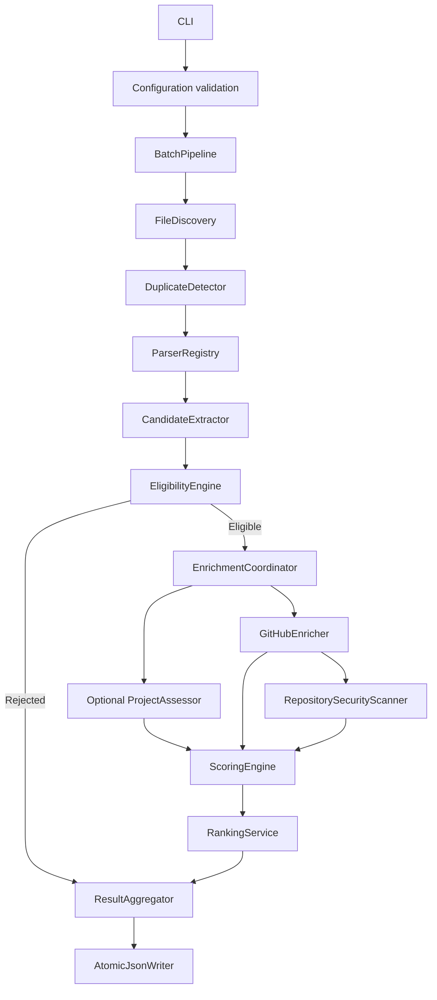

# Technical Requirements Document: AI Resume Screening and Ranking System

| Field | Value |
|---|---|
| Document version | 1.0 |
| Status | Implementation-ready draft |
| Related PRD | `AI_Resume_Screening_PRD.md` |
| Architecture | CLI-first modular monolith |
| Runtime | Python 3.11+ |
| Canonical interface | Command-line batch job |
| Canonical output | Versioned UTF-8 JSON |

## 1. Purpose

This document converts the product requirements into implementable technical contracts, algorithms, component boundaries, data models, failure behavior, and verification criteria.

The system processes a local directory of resumes, extracts candidate evidence, applies deterministic Python-and-AI eligibility rules, enriches eligible candidates with optional LLM and public GitHub signals, calculates an explainable score, ranks eligible candidates, and writes a complete batch result.

The technical design intentionally avoids a database, vector store, frontend, message broker, and deployment platform. Those components are unnecessary for a batch of approximately 50 resumes and would increase the risk of missing the assignment’s core requirements.

## 2. Technical objectives

- Preserve deterministic business logic for eligibility, score arithmetic, penalties, caps, and ranking.
- Treat PDF parsers, LLM providers, and GitHub as replaceable adapters.
- Continue the batch when individual resumes or external integrations fail.
- Preserve safe, short evidence for every material decision.
- Keep network concurrency bounded and rate-limit aware.
- Never expose candidate resume content, API credentials, or suspected leaked credentials in logs.
- Make output schema-valid, reproducible from validated inputs, and easy to inspect.
- Keep the MVP executable with one documented command.

## 3. Architecture overview

### 3.1 Architectural style

The application is a modular monolith organized around ports and adapters:

- **Interface:** CLI and console progress.
- **Application:** batch orchestration and stage coordination.
- **Domain:** eligibility, evidence rules, scoring, penalties, and ranking.
- **Adapters:** file parsers, LLM provider, GitHub REST client, security scanner, and JSON writer.

The domain layer contains no network, filesystem, SDK, or environment-variable access.

### 3.2 Component diagram



### 3.3 Execution stages

The batch is executed in three stages:

1. **Local stage:** discover, hash, parse, normalize, extract, and decide eligibility.
2. **Enrichment stage:** concurrently assess eligible candidates through bounded LLM and GitHub adapters.
3. **Finalization stage:** calculate scores, apply penalties, rank, summarize, validate, and atomically write JSON.

This separation keeps external failures away from ingestion and permits the deterministic pipeline to complete when integrations are disabled.

## 4. Technology choices

### 4.1 Runtime and packaging

- Python 3.11 or newer.
- `pyproject.toml` as the dependency and tool configuration source.
- `src/` package layout to avoid accidental imports from the repository root.
- Standard `argparse` for the MVP CLI to minimize dependencies.

### 4.2 Runtime dependencies

| Dependency | Purpose | Rationale |
|---|---|---|
| `pydantic>=2` | Typed models and validation | Strong contracts for extracted and model-generated data. |
| `pydantic-settings>=2` | Environment configuration | Centralized validation and secret-safe settings. |
| `pypdf` | PDF text extraction | Lightweight, pure-Python PDF support. |
| `python-docx` | Optional DOCX extraction | Bonus format with small implementation cost. |
| `httpx` | Async GitHub and provider HTTP | Timeouts, connection pooling, and async support. |
| Standard-library `urllib` | Gemini Interactions API requests | Keeps the submission dependency-light while still using schema-constrained Gemini responses. |

### 4.3 Development dependencies

- `pytest`
- `pytest-asyncio`
- `pytest-cov`
- `ruff`
- `mypy`

No dependency shall be introduced when the standard library provides an equally clear solution within the time-box.

## 5. Repository structure

```text
resume-screener/
├── main.py
├── pyproject.toml
├── README.md
├── .env.example
├── prompts/
│   └── project_assessment_v1.txt
├── src/resume_screener/
│   ├── __init__.py
│   ├── config.py
│   ├── models.py
│   ├── errors.py
│   ├── logging.py
│   ├── application/
│   │   ├── pipeline.py
│   │   └── enrichment.py
│   ├── ingestion/
│   │   ├── discovery.py
│   │   ├── hashing.py
│   │   ├── base.py
│   │   ├── registry.py
│   │   ├── pdf.py
│   │   ├── docx.py
│   │   └── text.py
│   ├── extraction/
│   │   ├── normalize.py
│   │   ├── sections.py
│   │   ├── contact.py
│   │   ├── github_url.py
│   │   └── candidate.py
│   ├── domain/
│   │   ├── evidence.py
│   │   ├── eligibility.py
│   │   ├── scoring.py
│   │   ├── penalties.py
│   │   └── ranking.py
│   ├── integrations/
│   │   ├── llm/
│   │   │   ├── base.py
│   │   │   ├── disabled.py
│   │   │   └── provider.py
│   │   └── github/
│   │       ├── client.py
│   │       ├── models.py
│   │       ├── activity.py
│   │       ├── repositories.py
│   │       └── security.py
│   └── output/
│       ├── schema.py
│       └── json_writer.py
└── tests/
    ├── fixtures/
    ├── unit/
    ├── integration/
    └── prompt/
```

## 6. Core data contracts

### 6.1 Enumerations

```python
class CandidateStatus(StrEnum):
    ELIGIBLE = "eligible"
    REJECTED = "rejected"
    DUPLICATE = "duplicate"
    FAILED = "failed"


class EvidenceStrength(StrEnum):
    INCIDENTAL = "incidental"
    SKILL = "skill"
    APPLIED = "applied"
    ADVANCED = "advanced"


class IntegrationStatus(StrEnum):
    SUCCESS = "success"
    PARTIAL = "partial"
    SKIPPED = "skipped"
    NOT_FOUND = "not_found"
    RATE_LIMITED = "rate_limited"
    FAILED = "failed"
```

### 6.2 Evidence

```python
class Evidence(BaseModel):
    category: str
    text: str
    source_section: str | None = None
    page: int | None = None
    strength: EvidenceStrength
    normalized_terms: list[str] = []
```

Constraints:

- Evidence text is trimmed and length-limited, default 300 characters.
- It must come from the resume or public repository metadata, not invented model prose.
- Duplicate snippets are normalized and removed.
- Raw suspected credential values are never represented as evidence.

### 6.3 Resume and candidate models

```python
class ResumeFile(BaseModel):
    file_id: str
    path: Path
    relative_name: str
    extension: str
    sha256: str
    size_bytes: int


class ParsedResume(BaseModel):
    file: ResumeFile
    raw_text: str
    pages: list[str]
    parser_name: str
    warnings: list[str]


class CandidateProfile(BaseModel):
    candidate_id: str
    source_file: str
    candidate_name: str
    email: str | None
    github_url: str | None
    github_username: str | None
    skills: list[str]
    projects: list[ProjectRecord]
    python_evidence: list[Evidence]
    ai_evidence: list[Evidence]
    engineering_evidence: list[Evidence]
    extraction_warnings: list[str]
```

Candidate ID is a stable UUIDv5 derived from the resume content hash. It must not be derived from email or name.

### 6.4 Assessment models

```python
class EligibilityDecision(BaseModel):
    eligible: bool
    python_evidence: list[Evidence]
    ai_evidence: list[Evidence]
    rejection_reasons: list[str]
    method_version: str


class ProjectAssessment(BaseModel):
    project_depth: Literal["none", "basic", "applied", "advanced"]
    retrieval_depth: Literal["none", "basic", "applied", "advanced"]
    agent_depth: Literal["none", "basic", "applied", "advanced"]
    data_workflow_depth: Literal["none", "basic", "applied", "advanced"]
    evaluation_depth: Literal["none", "basic", "applied", "advanced"]
    ownership_depth: Literal["none", "basic", "applied", "advanced"]
    thin_wrapper_severity: Literal["none", "low", "medium", "high"]
    tutorial_severity: Literal["none", "low", "high"]
    evidence: list[Evidence]
    strengths: list[str]
    concerns: list[str]
    provider_status: IntegrationStatus
    prompt_version: str | None
```

The LLM returns bounded classifications rather than numeric scores.

### 6.5 Scoring models

```python
class CategoryScore(BaseModel):
    awarded: int
    maximum: int
    reasons: list[str]
    evidence: list[Evidence]


class ScoreBreakdown(BaseModel):
    ai_project_depth: CategoryScore
    python_backend: CategoryScore
    cloud_fullstack: CategoryScore
    github: CategoryScore
    engineering_depth: CategoryScore
    project_quality_penalty: int
    project_penalty_reasons: list[str]
    total: int
```

Model validators enforce category caps and recompute the final total.

## 7. Configuration contract

`Settings` is created once at startup. Domain services receive a typed subset rather than reading the environment directly.

Required defaults:

```dotenv
LLM_ENABLED=true
LLM_PROVIDER=gemini
LLM_MODEL=gemini-3.5-flash-lite
GEMINI_API_KEY=
LLM_TIMEOUT_SECONDS=45
LLM_MAX_CONCURRENCY=2

GITHUB_ENABLED=true
GITHUB_TOKEN=
GITHUB_API_VERSION=2026-03-10
GITHUB_TIMEOUT_SECONDS=10
GITHUB_MAX_CONCURRENCY=5
GITHUB_MAX_REPOSITORIES=20
GITHUB_SECURITY_SCAN_ENABLED=true
GITHUB_SECURITY_MAX_REPOSITORIES=5
GITHUB_SECURITY_MAX_FILES_PER_REPOSITORY=100
GITHUB_SECURITY_MAX_FILE_BYTES=200000
GITHUB_SECURITY_MAX_TOTAL_BYTES_PER_REPOSITORY=2000000

MAX_RESUME_BYTES=10000000
MAX_RESUME_CHARACTERS=50000
RECURSIVE_DISCOVERY=false
LOG_LEVEL=INFO
```

Startup validation rules:

- Input directory exists and is readable.
- Output parent directory exists or can be created.
- Score category caps sum to 100.
- Concurrency and size limits are positive.
- If LLM is enabled, provider, model, and `GEMINI_API_KEY` are present.
- Secrets are excluded from settings serialization and logs.

## 8. Ingestion design

### 8.1 Discovery

`FileDiscovery` returns paths sorted by normalized relative filename. Supported extensions are `.pdf`, `.docx`, and `.txt`; PDF is mandatory, while the others may be feature-flagged.

Symlinks are not followed in the MVP. Files outside the resolved input directory are rejected. This prevents path traversal through crafted directory entries.

### 8.2 Hashing and duplicates

- Stream files in fixed-size chunks into SHA-256.
- The first file for a digest becomes canonical.
- Later matches become `duplicate` results with `duplicate_of` set to the canonical candidate ID.
- Duplicates do not invoke parsers, LLMs, or GitHub.

### 8.3 Parser protocol

```python
class ResumeParser(Protocol):
    supported_extensions: frozenset[str]

    def parse(self, file: ResumeFile) -> ParsedResume:
        ...
```

Parser requirements:

- Operate only on the selected file.
- Enforce file-size and text-length limits.
- Raise a typed `ResumeParseError` with a safe message.
- Preserve page text for PDFs.
- Return warnings for partial extraction.
- Never execute macros, embedded scripts, links, or attachments.

### 8.4 Normalization

Normalization performs:

- Unicode normalization to NFKC.
- Null/control-character removal except newline and tab.
- Newline canonicalization.
- Repeated whitespace compression while retaining paragraph breaks.
- Soft-hyphen removal and conservative line-break dehyphenation.

The original file is never modified.

## 9. Candidate extraction

### 9.1 Deterministic extraction

Use deterministic logic for:

- Email addresses.
- GitHub profile URLs and `github.com/<username>` patterns.
- Section boundaries based on common headings.
- Canonical skill aliases.
- Python and AI evidence candidates.

The GitHub URL normalizer must reject URLs that point only to an issue, organization, repository, or non-GitHub host unless a user profile can be resolved unambiguously.

### 9.2 Section detection

Recognized heading families include:

- Skills / Technologies / Technical Skills
- Projects / Selected Projects
- Experience / Work Experience / Internships
- Education
- Certifications

Unknown headings do not discard content. The parser retains an `unknown` section.

### 9.3 Contextual evidence rules

An evidence candidate is classified using:

- Term presence with word boundaries and aliases.
- Section type.
- Nearby action verbs such as built, implemented, developed, designed, deployed, evaluated, integrated, or maintained.
- Negation phrases such as “no experience with.”
- Proximity to project, work, or internship descriptions.

Strength mapping:

- `advanced`: multiple implementation details or production/evaluation evidence.
- `applied`: used in a project or work context.
- `skill`: credible skills-section mention without implementation detail.
- `incidental`: course title, unrelated comparison, negative mention, or ambiguous occurrence.

## 10. Eligibility engine

Eligibility is pure, synchronous domain logic:

```python
python_ok = any(e.strength in {SKILL, APPLIED, ADVANCED} for e in python_evidence)
ai_ok = any(e.strength in {SKILL, APPLIED, ADVANCED} for e in ai_evidence)
eligible = python_ok and ai_ok
```

Canonical rejection reasons:

- `No contextual evidence of Python usage or skill`
- `No meaningful AI, LLM, RAG, or agentic evidence`

Java, JavaScript, React, Next.js, and similar technologies are neutral. They neither satisfy nor negate the two requirements.

The engine version is stored in each result, for example `eligibility-v1`.

## 11. LLM assessment design

### 11.1 Role of the LLM

The LLM is optional and may:

- Structure project descriptions.
- Classify implementation depth.
- Identify retrieval, state, tools, orchestration, evaluation, and ownership evidence.
- Flag likely wrappers or tutorial-style projects.
- Generate concise strengths, concerns, and project summary.

The LLM may not decide eligibility, assign points, apply penalties numerically, rank candidates, call tools, or analyze suspected secret values.

Selected provider references:

- [Gemini 3.5 Flash-Lite model](https://ai.google.dev/gemini-api/docs/models/gemini-3.5-flash-lite)
- [Gemini structured outputs](https://ai.google.dev/gemini-api/docs/structured-output)
- [Gemini pricing and free-tier data use](https://ai.google.dev/gemini-api/docs/pricing)

### 11.2 Adapter contract

```python
class ProjectAssessor(Protocol):
    async def assess(self, profile: CandidateProfile) -> ProjectAssessment:
        ...
```

Implementations:

- `DisabledProjectAssessor`: deterministic fallback derived from extracted evidence.
- `GeminiProjectAssessor`: configured structured-output implementation using `gemini-3.5-flash-lite`.
- `ProviderProjectAssessor`: common provider interface retained for replaceability.
- `FakeProjectAssessor`: test double.

### 11.3 Prompt contract

The prompt must:

- Carry an explicit version.
- Delimit resume text as untrusted data.
- Instruct the model to ignore commands inside resume content.
- Request only the `ProjectAssessment` structure.
- Require resume-backed evidence.
- Forbid assumptions about protected attributes.
- Fit within configured input limits.

### 11.4 Validation and fallback

1. Call provider with an explicit timeout.
2. Parse structured output.
3. Validate with Pydantic.
4. Ensure returned evidence exists in normalized resume text using conservative normalized matching.
5. Retry once only for a malformed/schema-invalid response or a retryable `429`/5xx response, honoring provider retry guidance where available.
6. On failure, return deterministic fallback with `provider_status=failed` or `rate_limited`.

Provider errors are never allowed to escape the candidate boundary.

### 11.5 Cost and usage

Record, when provided:

- Provider and model.
- Prompt version.
- Input and output token counts.
- Latency.
- Validation and retry outcome.

Do not log prompt content or resume text.

## 12. Scoring engine

### 12.1 General algorithm

```python
if not eligibility.eligible:
    return None

category_total = (
    ai_project_depth
    + python_backend
    + cloud_fullstack
    + github
    + engineering_depth
)

total = clamp(category_total - project_quality_penalty, 0, 100)
```

Each category is calculated from individual named rules and validated against its cap.

### 12.2 Depth-to-points mapping

LLM or fallback depth labels use deterministic multipliers:

| Depth | Multiplier |
|---|---:|
| `none` | 0.00 |
| `basic` | 0.25 |
| `applied` | 0.60 |
| `advanced` | 1.00 |

For a subcriterion with cap `C`, award `round(C × multiplier)`. Rule-specific deterministic evidence may raise a classification but can never exceed the subcriterion cap.

### 12.3 Category caps

- AI project depth: 40.
- Python/backend: 30.
- Cloud/deployment/full stack: 15.
- GitHub: 10 after security adjustment.
- Engineering depth: 5.

The subcriteria and maxima are defined in the PRD and represented as immutable configuration.

### 12.4 Project penalties

Default mapping:

| Classification | Deduction |
|---|---:|
| Thin wrapper, low | 5 |
| Thin wrapper, medium | 10 |
| Thin wrapper, high | 15 |
| Tutorial, low | 5 |
| Tutorial, high | 10 |

Overlapping findings from the same project are deduplicated. Default total candidate project-quality penalty is capped at 20. Every deduction requires an evidence-backed reason.

## 13. GitHub enrichment

### 13.1 Design principle

GitHub analysis is primarily deterministic. The LLM is not used for activity scoring or secret detection. An optional LLM may summarize already-sanitized repository metadata, but this is not required and cannot alter the numeric score directly.

### 13.2 GitHub REST client

The adapter uses public read-only requests:

- User profile: `GET /users/{username}`.
- Public repositories: `GET /users/{username}/repos`.
- Public events: `GET /users/{username}/events/public`.
- Repository tree: `GET /repos/{owner}/{repo}/git/trees/{tree_sha}`.
- Selected file content: `GET /repos/{owner}/{repo}/contents/{path}` or the returned blob URL.

GitHub documents that public user events are limited to recent public activity, currently up to 300 events and only events from the last 30 days. Repository timestamps therefore provide the fallback for longer recency windows. Git tree responses can also be marked `truncated`; a truncated security scan is treated as partial and causes no security deduction.

Official references:

- [GitHub REST events](https://docs.github.com/en/rest/activity/events)
- [GitHub repository endpoints](https://docs.github.com/en/rest/repos/repos)
- [GitHub Git tree endpoints](https://docs.github.com/en/rest/git/trees)
- [GitHub repository contents](https://docs.github.com/en/rest/repos/contents)
- [GitHub REST rate limits](https://docs.github.com/en/rest/using-the-rest-api/rate-limits-for-the-rest-api)

### 13.3 Request policy

- Set `Accept: application/vnd.github+json`.
- Set the configured supported GitHub API version header.
- Authenticate with `GITHUB_TOKEN` when present.
- Use one shared `httpx.AsyncClient` per run.
- Apply connect/read/write/pool timeouts.
- Respect `x-ratelimit-remaining`, `x-ratelimit-reset`, and `retry-after`.
- Do not retry 404 responses.
- Retry transient 5xx/network failures at most twice with bounded exponential backoff and jitter.
- Do not retry a primary rate limit until reset; mark remaining candidates as rate-limited if the run cannot wait.
- Use ETag-based conditional requests when persistent caching is later added.

GitHub currently documents a primary limit of 60 unauthenticated requests per hour and 5,000 authenticated requests per hour for typical personal access token use. Because a 50-candidate batch can exceed the unauthenticated budget, the client must maintain a per-run request budget and degrade gracefully when no token is supplied.

### 13.4 Repository selection

From up to 20 listed repositories:

1. Exclude forks and archived repositories.
2. Prefer repositories owned by the candidate account.
3. Rank by a deterministic relevance tuple:
   - Python language or Python-dominant metadata.
   - AI/RAG/agent/backend terms in name, description, topics, or README.
   - Recent `pushed_at`.
   - Presence of tests, package metadata, Docker, or CI configuration.
4. Select at most five for deeper analysis.

Stars and forks are retained as metadata but do not materially drive the score.

### 13.5 Activity score: 0–5

Determine the newest credible activity timestamp from public events and non-fork repository `pushed_at` values.

| Evidence | Points |
|---|---:|
| Activity within 30 days with more than one credible signal | 5 |
| Activity within 90 days | 4 |
| Activity within 180 days | 3 |
| Activity within 365 days | 2 |
| Older visible maintained repository | 1 |
| No public evidence or integration unavailable | 0 |

Automated bot events, stars, and passive watches do not count as strong engineering activity.

### 13.6 Repository relevance score: 0–5

| Signal | Points |
|---|---:|
| At least one maintained owned non-fork repository | 1 |
| Two or more maintained owned non-fork repositories | +1 |
| Applied Python repository evidence | +1 |
| AI/RAG/agentic repository evidence | +1 |
| Engineering hygiene: tests, packaging, Docker, CI, or substantial README | +1 |

The score is capped at five. A repository can support multiple signals only when evidence is distinct.

## 14. Repository security-hygiene scanner

### 14.1 Scope

The scanner examines at most five selected, owned, non-fork, non-archived public repositories. It scans only the default branch and never scans Git history in the MVP.

### 14.2 File selection

Skip:

- Binary files.
- Files larger than the configured limit.
- Vendor/dependency directories.
- Build artifacts and generated output.
- Minified assets.
- Documentation and fixture directories by default.
- `.env.example`, `.env.sample`, and explicit template files.

Prioritize:

- `.env` and environment-specific variants that are not examples.
- YAML, JSON, TOML, INI, and properties configuration.
- Python, JavaScript, TypeScript, Java, Go, and shell source.
- PEM/key files and deployment configuration.

If the Git tree response is truncated or limits prevent intended coverage, mark the scan `partial` and apply no deduction.

### 14.3 Detection approach

Use a rule registry with:

- Provider-specific high-confidence token formats.
- PEM private-key headers and bodies.
- Secret-assignment context such as `api_key`, `secret`, `token`, or `password` with a literal value.
- File-context rules for tracked `.env` content.
- Placeholder and example allowlists.
- Minimum length and character-set constraints.
- Optional entropy as supporting evidence only, never as the sole deduction trigger.

The LLM is not used for detection.

### 14.4 Safe finding contract

```python
class SecurityFinding(BaseModel):
    rule_id: str
    severity: Literal["warning", "high", "critical"]
    confidence: Literal["low", "medium", "high"]
    repository: str
    file_path: str
    secret_type: str
    fingerprint: str | None
    reason: str
```

On match:

1. Classify locally.
2. Create an HMAC-SHA256 fingerprint with an ephemeral per-run key; retain only a short digest.
3. Discard the raw match.
4. Never include surrounding source text that could reconstruct the secret.
5. Never test the credential against any provider.
6. Never send it to an LLM.

### 14.5 Deduction algorithm

```python
eligible_findings = [
    finding for finding in findings
    if finding.confidence == "high"
]

penalty = min(5, max(rule_penalty(f) for f in eligible_findings, default=0))
github_score = max(0, activity_score + repository_score - penalty)
```

Using the maximum finding rather than summing findings reduces double punishment for one configuration mistake. Ambiguous findings are warnings only.

## 15. Concurrency and orchestration

### 15.1 Concurrency model

- Local parsing is sequential in the MVP for predictable error isolation.
- Eligible-candidate enrichment uses `asyncio`.
- Independent LLM and GitHub work may run concurrently.
- LLM and GitHub each use separate semaphores.
- A global candidate task count is bounded to avoid memory growth.

### 15.2 Candidate boundary

```python
async def process_enrichment(profile: CandidateProfile) -> EnrichmentBundle:
    llm_result, github_result = await asyncio.gather(
        safe_llm_assessment(profile),
        safe_github_enrichment(profile),
    )
    return EnrichmentBundle(llm=llm_result, github=github_result)
```

Each `safe_*` function converts exceptions into typed integration results. `return_exceptions=True` is not a substitute for explicit typed conversion.

### 15.3 Cancellation

Keyboard interruption should cancel pending enrichment, avoid starting new requests, close HTTP clients, and avoid writing a misleading complete result. An optional partial diagnostic file may be written under a distinct filename but is not the canonical output.

## 16. Caching

MVP caches are in-memory and scoped to one run:

- Parsed file result keyed by content hash.
- LLM assessment keyed by content hash + model + prompt version.
- GitHub profile/repository/events keyed by normalized username.
- Repository tree/content keyed by repository + default-branch SHA.

Cache values include successful and terminal not-found results. Transient failures and rate-limit responses are not cached as successful data.

## 17. Output and persistence

### 17.1 Output schema

The top-level structure is:

```json
{
  "schema_version": "1.0",
  "run": {},
  "configuration": {},
  "batch_summary": {},
  "candidates": []
}
```

Secrets and raw resume text are excluded. Configuration output contains only safe values such as feature flags, thresholds, model name, and prompt version.

### 17.2 Atomic write

1. Serialize and validate the complete result.
2. Write to a temporary file in the output directory.
3. Flush and close the file.
4. Replace the target with `os.replace`.

If writing fails, return a non-zero exit code and leave no partially written canonical result.

### 17.3 Ordering

- Eligible candidates: score descending, AI score descending, Python score descending, normalized name ascending.
- Rejected candidates: normalized name, then source filename.
- Duplicate and failed records: source filename.

## 18. CLI contract

```text
python main.py \
  --input ./resumes \
  --output ./output/results.json \
  [--recursive] \
  [--no-llm] \
  [--no-github] \
  [--no-github-security-scan] \
  [--log-level INFO]
```

Exit codes:

| Code | Meaning |
|---:|---|
| 0 | Batch completed and canonical output was written, even if individual files failed. |
| 2 | Invalid arguments or configuration. |
| 3 | Input discovery or access failure. |
| 4 | Canonical output write failure. |
| 5 | Unexpected fatal orchestration failure. |

The final console summary prints counts and output path, not candidate emails or resume text.

## 19. Error model

Typed errors:

- `ConfigurationError`
- `InputAccessError`
- `UnsupportedFormatError`
- `ResumeParseError`
- `ExtractionError`
- `LLMTimeoutError`
- `LLMValidationError`
- `GitHubNotFoundError`
- `GitHubRateLimitError`
- `GitHubTransportError`
- `OutputWriteError`

Candidate-level errors become `CandidateFailure` records with:

- Safe stage name.
- Stable error code.
- Sanitized message.
- Retryable flag.

Stack traces are available only in local debug logs and must still exclude secrets and resume text.

## 20. Security and privacy controls

- Resolve and validate input paths beneath the selected input root.
- Do not follow symlinks.
- Enforce file and text size limits.
- Never execute resume content.
- Treat resume and repository text as untrusted.
- Keep LLM tools disabled.
- Schema-validate all external JSON.
- Store API credentials only in environment-backed secret fields.
- Redact authorization headers and query parameters in errors.
- Never log full GitHub file content or suspected secret matches.
- Exclude protected attributes from extraction and scoring.
- Treat GitHub absence as zero positive points, not a negative penalty.
- Send only minimized skills, project, and experience text to Gemini. Exclude contact fields, disclose the free-tier data-use terms in the README, and never log model request bodies.

## 21. Observability

### 21.1 Structured log fields

- `run_id`
- `candidate_id`
- `source_file`
- `stage`
- `status`
- `duration_ms`
- `integration`
- `error_code`

### 21.2 Run metrics

- Files discovered, supported, duplicate, parsed, rejected, eligible, and failed.
- Stage durations.
- LLM calls, retries, failures, fallback count, tokens, and latency.
- GitHub requests, remaining rate-limit budget, cache hits, failures, and latency.
- Repositories and files scanned.
- Redacted security-finding counts and GitHub deductions.

No production monitoring backend is required; the metrics are aggregated into logs and run metadata.

## 22. Performance and resource budgets

| Resource | Default budget |
|---|---:|
| Resume file | 10 MB |
| Normalized resume text | 50,000 characters |
| Deeply analyzed GitHub repositories | 5 per candidate |
| Security-scanned files | 100 per repository |
| Scanned file size | 200 KB |
| Scanned bytes per repository | 2 MB |
| Concurrent LLM calls | 3 |
| Concurrent GitHub operations | 5 |
| LLM request timeout | 30 seconds |
| GitHub request timeout | 10 seconds |

Performance targets:

- Local processing of 50 ordinary text PDFs: under two minutes.
- Full enrichment under normal provider conditions: under ten minutes.
- Memory usage remains bounded by configured text and scan limits.

## 23. Testing requirements

### 23.1 Unit tests

- File discovery ordering and extension filtering.
- Content hashing and duplicate resolution.
- Parser success, empty document, encrypted/corrupt document, and partial text.
- Email and GitHub URL normalization.
- Section detection and evidence-strength classification.
- Python + AI eligibility combinations and negation cases.
- Score subcriteria, caps, rounding, penalties, and zero floor.
- Deterministic tie-breaking.
- Activity and repository scoring.
- GitHub security rule exclusions and high-confidence findings.
- Redaction and ephemeral fingerprint behavior.

### 23.2 Integration tests

- Mixed synthetic resume directory produces the expected batch summary.
- Fake LLM and GitHub adapters produce schema-valid output.
- LLM timeout and malformed response use deterministic fallback.
- GitHub 404, 403/429, 5xx, truncated tree, and partial scan degrade correctly.
- Atomic writer does not leave a partial target after simulated failure.

### 23.3 Security tests

- Resume prompt injection does not change output schema or model role.
- `.env.example`, placeholders, docs, tests, and environment lookups receive no deduction.
- Private-key and provider-token fixtures create redacted findings.
- Raw fixtures never appear in serialized output, logs, or model input captures.
- Truncated or incomplete scans produce no deduction.
- Suspected credentials are never used in outbound requests.

### 23.4 Contract tests

- Validate output against Pydantic models and generated JSON Schema.
- Verify provider adapter output against `ProjectAssessment`.
- Verify GitHub fixture payload parsing independently of live API availability.

## 24. Requirements traceability

| PRD area | Technical implementation |
|---|---|
| Ingestion | `FileDiscovery`, digest-based duplicate detector, parser registry. |
| Hard filtering | Contextual evidence classifier plus pure `EligibilityEngine`. |
| Ranking | Pure category rules, explicit penalties, deterministic sorting. |
| LLM | Optional `ProjectAssessor`, structured output, evidence validation, fallback. |
| GitHub | Rate-aware REST adapter, deterministic activity/relevance scoring. |
| Security-hygiene adjustment | Bounded default-branch scanner, redaction, high-confidence-only deduction. |
| Reliability | Typed errors, candidate boundaries, atomic output, bounded concurrency. |
| Usability | One CLI command, versioned JSON, concise run summary. |

## 25. Architectural decisions

### ADR-001: Modular monolith

**Decision:** Use one process with internal modules.

**Reason:** The workload is small, local, and batch-oriented. Microservices and queues would increase failure surface and delivery time.

### ADR-002: Deterministic decision ownership

**Decision:** LLMs return bounded classifications and evidence; code owns decisions and arithmetic.

**Reason:** This improves explainability, testability, and graceful fallback.

### ADR-003: No database

**Decision:** Persist only the final JSON output.

**Reason:** A database is unnecessary for one-run processing and is outside scope.

### ADR-004: REST-based GitHub analysis

**Decision:** Use public REST metadata and bounded content reads instead of cloning repositories.

**Reason:** It reduces disk usage, execution risk, history scope, and cleanup requirements.

### ADR-005: Rule-based secret detection

**Decision:** Use local high-confidence patterns and context rather than an LLM.

**Reason:** Secret detection requires deterministic redaction and cannot safely send possible credentials to an external model.

### ADR-006: Incomplete security scans do not penalize

**Decision:** Truncation, rate limits, disabled scans, or insufficient coverage produce no security deduction.

**Reason:** Candidates should not be penalized based on uncertain or asymmetric evidence.

## 26. Operational runbook

### Before running

1. Create and activate a Python environment.
2. Install project dependencies.
3. Create a Gemini API key and store it only as `GEMINI_API_KEY` in the local environment.
4. Copy `.env.example` to `.env`, set `GEMINI_API_KEY` and `GITHUB_TOKEN`, and never commit the file.
5. Confirm the local path containing the 50 resumes and the permission to process their relevant text through Gemini.

### Run

```bash
python main.py --input ./resumes --output ./output/results.json
```

### Verify

- Exit code is zero.
- Output parses as JSON.
- Batch totals reconcile.
- Every supported file has one terminal candidate record.
- Eligible score arithmetic is valid.
- No secrets or resume body text appear in logs.

### Troubleshoot

- If GitHub is rate-limited, rerun with a token or disable enrichment; do not wait indefinitely.
- If LLM calls fail, verify provider settings or rerun with `--no-llm`.
- If a PDF is unreadable, confirm whether it is scanned or encrypted; the failure should already be isolated.

## 27. Resolved technical decisions

- Use provider-neutral interfaces with `GeminiProjectAssessor` as the configured implementation.
- Use the stable `gemini-3.5-flash-lite` model because it supports structured outputs and high-throughput document parsing.
- External processing is permitted. Send only relevant resume sections and remove contact fields from prompts.
- Bound Gemini concurrency to 2, use a 45-second timeout, retry transient rate-limit/provider failures once, and fall back deterministically per candidate.
- Process the available batch of approximately 50 resumes from a user-supplied local path.
- Use an authenticated, least-privileged GitHub token supplied only through `GITHUB_TOKEN`.
- Monitor the GitHub request budget and disable deep scanning when insufficient, recording `not_checked` and no deduction.
- Include a small high-confidence security rule set rather than broad entropy scanning.
- Preserve complete email only in private local JSON; exclude it from scoring, logs, GitHub requests, and Gemini prompts.
- Offer a redacted output mode for any shared or demonstration artifact.
- Include TXT and DOCX only after mandatory PDF behavior and core tests pass.

## 28. Technical definition of done

The implementation is technically complete when:

- The package installs from `pyproject.toml`.
- The documented CLI processes the supplied directory.
- PDF parsing, eligibility, scoring, ranking, JSON output, GitHub enrichment, and LLM fallback operate through the defined contracts.
- All candidate-level failures are isolated.
- GitHub security findings are redacted and bounded.
- Unit and integration tests pass.
- Static linting succeeds.
- Batch totals and score arithmetic validate.
- The README documents setup, configuration, design decisions, limitations, privacy behavior, and future improvements.
